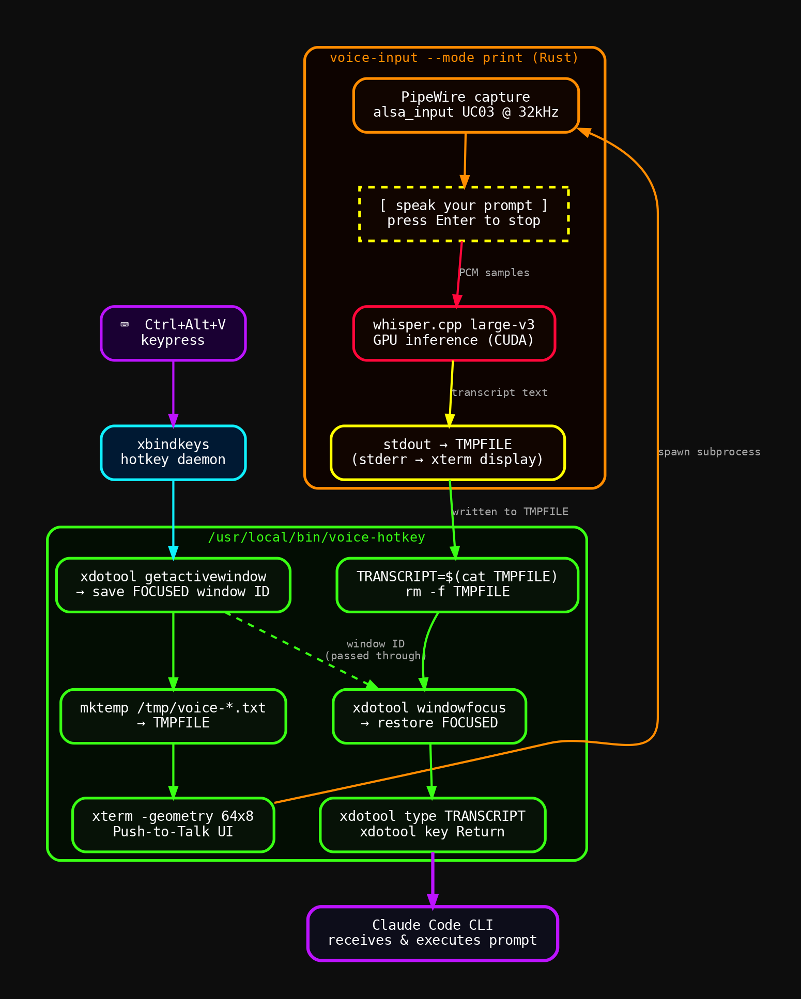
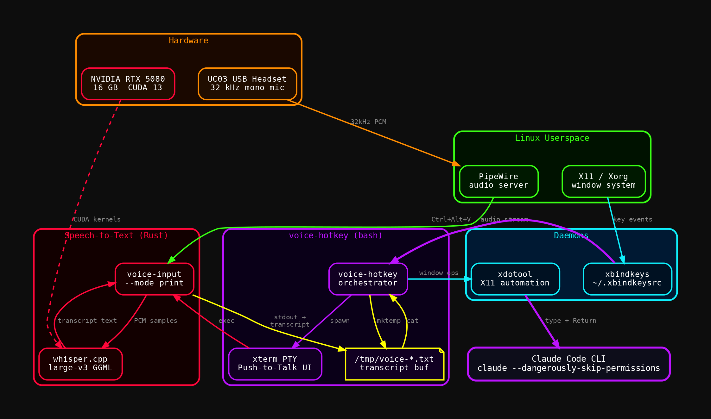

# voice-hotkey

**Global push-to-talk for Claude Code and any Linux terminal.**

Press **Ctrl+Alt+V** from anywhere on your desktop. Speak your prompt. Press Enter. Your words are transcribed by [whisper.cpp](https://github.com/ggerganov/whisper.cpp) on-device (GPU-accelerated) and typed directly into Claude Code — no copy-paste, no mouse.

Built as a thin bash orchestrator around [`voice-input`](https://github.com/danindiana/voice-input) (Rust + whisper.cpp). Works with any X11 terminal emulator.

---

## How it works

### Data flow



### Component architecture



---

## Requirements

| Package | Purpose |
|---------|---------|
| [`voice-input`](https://github.com/danindiana/voice-input) | Rust binary — mic capture + whisper.cpp inference |
| `xbindkeys` | Global hotkey daemon |
| `xterm` | Push-to-Talk UI popup |
| `xdotool` | Window focus & keystroke injection |

**Hardware:** USB microphone or headset. GPU optional (whisper.cpp falls back to CPU).

---

## Install

```bash
git clone https://github.com/danindiana/voice-hotkey
cd voice-hotkey
./install.sh
```

`install.sh` copies `voice-hotkey` to `/usr/local/bin/`, writes `~/.xbindkeysrc`, starts the daemon, and adds an autostart line to `~/.zshrc` (or `~/.bashrc`).

### Manual install

```bash
# 1. Install dependencies
sudo apt install xbindkeys xterm xdotool

# 2. Install voice-input (Rust, GPU-accelerated whisper)
#    See: https://github.com/danindiana/voice-input

# 3. Install the wrapper script
sudo cp voice-hotkey /usr/local/bin/
sudo chmod +x /usr/local/bin/voice-hotkey

# 4. Configure the hotkey
cp .xbindkeysrc.example ~/.xbindkeysrc
# Edit ~/.xbindkeysrc to change the key combo if desired

# 5. Start the daemon
pkill xbindkeys 2>/dev/null; xbindkeys

# 6. Autostart on login (zsh)
echo 'pgrep xbindkeys >/dev/null || xbindkeys' >> ~/.zshrc
```

---

## Usage

1. Focus your Claude Code terminal (or any terminal / text field)
2. Press **Ctrl+Alt+V**
3. A small `Push-to-Talk` xterm appears in the top-right corner
4. Speak your prompt — you'll see `[voice-input] Recording… press Enter to stop`
5. Press **Enter** in the xterm to stop
6. Whisper transcribes in ~1–3 s (GPU) or ~5–15 s (CPU)
7. xterm closes; your original window regains focus
8. The transcript is typed in and **Enter is pressed automatically**

### Changing the hotkey

Edit `~/.xbindkeysrc`:

```
"/usr/local/bin/voice-hotkey"
  Control+alt+v
```

Replace `Control+alt+v` with any combo. Run `xbindkeys --key` to identify key names interactively. Reload with:

```bash
pkill xbindkeys && xbindkeys
```

---

## How the focus trick works

`xdotool getactivewindow` captures the focused window ID **before** xterm opens. After transcription xterm closes, and `xdotool windowfocus --sync $FOCUSED` restores focus to the original terminal before typing — so the text lands in the right place regardless of what the user clicks during recording.

```bash
FOCUSED=$(xdotool getactivewindow)   # ← save before xterm steals focus
# ... xterm runs voice-input, writes transcript to tmpfile ...
xdotool windowfocus --sync "$FOCUSED"
xdotool type --clearmodifiers --delay 20 -- "$TRANSCRIPT"
xdotool key Return
```

---

## Whisper model

`voice-input` defaults to `large-v3` (GGML format, ~3.1 GB). Smaller models trade accuracy for speed:

| Model | Size | GPU VRAM | Speed |
|-------|------|----------|-------|
| `large-v3` | 3.1 GB | ~4 GB | ~1–3 s |
| `medium` | 1.5 GB | ~2 GB | ~0.5–1 s |
| `small` | 466 MB | ~1 GB | ~0.3 s |
| `base` | 142 MB | <1 GB | ~0.2 s |

Change via `voice-input --model medium` (edit `voice-hotkey` to pass the flag).

---

## Tested on

- Ubuntu 24.04 / Debian Trixie
- X11 (Xorg) — Wayland not supported (xdotool limitation)
- PipeWire audio server
- NVIDIA RTX 5080 + CUDA 13 (also works CPU-only)
- UC03 USB headset (32 kHz native — other devices work at their native rate)

---

## Related projects

- [`voice-input`](https://github.com/danindiana/voice-input) — the Rust push-to-talk binary this wraps
- [`ollama-delegate`](https://github.com/danindiana/ollama-delegate) — delegate Claude Code tasks to local Ollama models

---

## License

MIT
